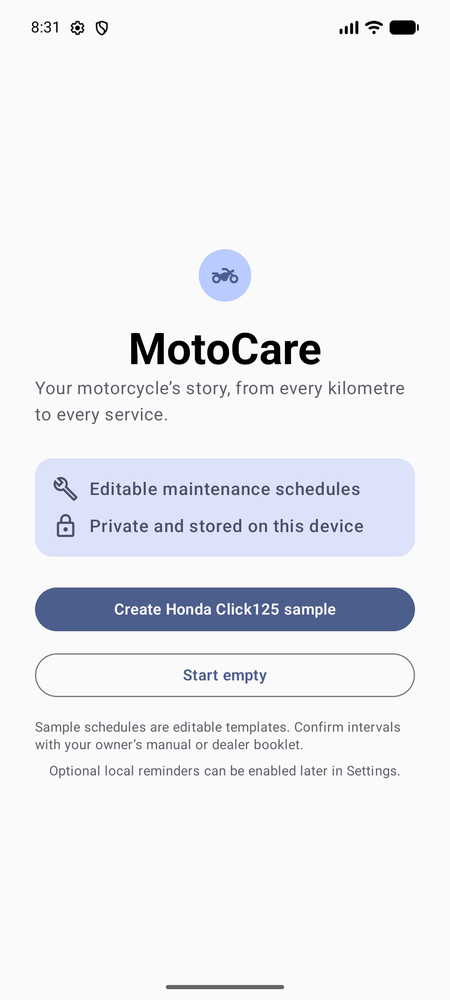
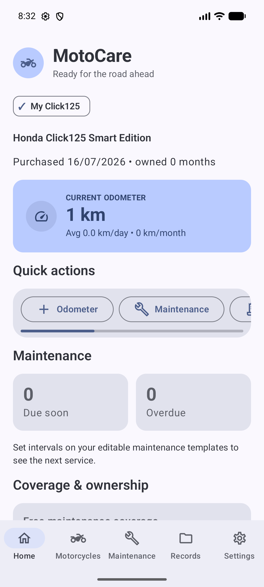
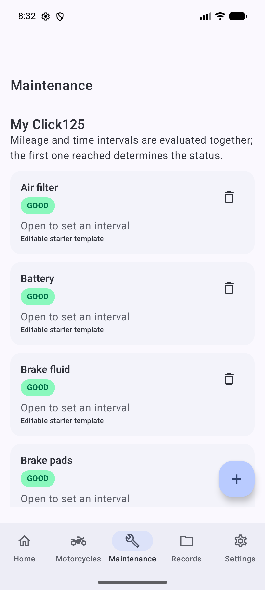

# MotoCare

MotoCare is a private, offline-first Android app for tracking motorcycle maintenance, mileage, fuel, expenses, documents, coverage, and ownership costs.

[Website](https://vectorlogic-dev.github.io/motorcycle-maintenance/) · [Privacy policy](https://vectorlogic-dev.github.io/motorcycle-maintenance/privacy/) · [Support](mailto:motocaresupport@icloud.com)

## Screenshots

<p align="center">
  
  
  
</p>

## Features

- Multiple motorcycle profiles with purchase details, masked optional identifiers, and archiving
- Odometer history with correction confirmation and automatic riding-rate summaries
- Editable maintenance schedules with mileage and time-based reminders
- Service history, problem tracking, receipt references, and attachment links
- Fuel logs with full-tank economy calculations
- Expense tracking with daily, monthly, and annual summaries
- Financing schedules, payment status, balances, rebates, and payoff estimates
- Registration, insurance, coverage, and document-expiry tracking
- Six-month cost and distance reports with native charts
- User-controlled JSON backup, restore, and CSV exports
- Light, dark, and system themes with accessible font scaling

Maintenance schedules included with the sample profile are editable templates. Always confirm service intervals using the motorcycle owner's manual or dealer booklet.

## Private by design

- No account or sign-in
- No advertising, analytics, or user tracking
- No network, location, camera, microphone, contacts, or broad storage permission
- App data stays on the device
- Backups, exports, receipts, and attachments use Android's system document picker
- Optional reminders are calculated locally from saved dates and mileage

See the [privacy policy](https://vectorlogic-dev.github.io/motorcycle-maintenance/privacy/) for complete details.

## Technology

MotoCare is built with Kotlin, Jetpack Compose, Material 3, Room, Hilt, Coroutines and Flow, WorkManager, DataStore, and Navigation Compose.

## Build

Requirements:

- Android Studio with JDK 17
- Android SDK 36

```shell
./gradlew testDebugUnitTest
./gradlew assembleDebug
./gradlew lintDebug
```

Run instrumentation tests with an emulator or device connected:

```shell
./gradlew connectedDebugAndroidTest
```

## Support

Questions and feedback are welcome at [motocaresupport@icloud.com](mailto:motocaresupport@icloud.com).

## License

No open-source license is currently granted. Copyright © 2026 vectorlogic. All rights reserved.
